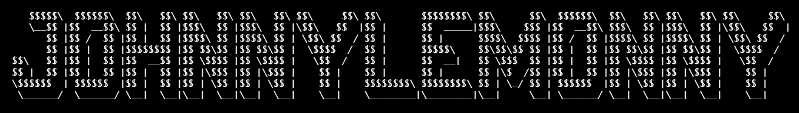

# Cabal Android (Zipline Branch)

This is a specialized branch of **Cabal Android** that uses **app.cash.zipline** as the JavaScript engine. 

---

## 🚀 Why Zipline?

This branch is specifically engineered for **Android 17 (API 37)** and future devices that require **16KB Page Size Alignment**. 

Legacy JavaScript engines like `quickjs-android` are physically incompatible with 16KB devices because their native binaries are aligned to 4KB. **Zipline** provides a modern, 16KB-ready successor that ensures Cabal remains operational on the newest Android hardware.

---

## 📖 Table of Contents
- [Key Differences](#key-differences)
- [Architecture](#architecture)
- [Technical Benefits](#technical-differences)
- [License](#license)

---

## 🔄 Key Differences (Zipline vs. Master)

| Feature | Master Branch | Zipline Branch |
| :--- | :--- | :--- |
| **JS Engine** | QuickJS-Android | **Zipline (1.27.0+)** |
| **16KB Support** | Limited / Incompatible | **Fully Supported** |
| **Bridge Security** | Interface-based | **Strongly Typed ZiplineServices** |
| **Diagnostics** | Standard Logcat | **Enhanced JS-to-Native Logging** |

---

## 🏗️ Architecture

The Zipline branch leverages `ZiplineService` interfaces to create a secure, type-safe bridge between Kotlin and the Cable protocol logic running in JavaScript.

### Secure Most (Bridges)
- **`NetworkBridge`**: Real-time TCP broadcasting.
- **`StorageBridge`**: Interface with the native SQLDelight `kv_store`.
- **`UIBridge`**: Triggers Compose UI updates upon receiving new chat events.

---

## 🛠️ Technical Benefits

1. **Page Size Compatibility**: Uses native binaries compiled with `-z max-page-size=16384`.
2. **Memory Safety**: Better memory management and closure of JS resources.
3. **Type Safety**: No more raw `evaluate()` calls for bridge interaction; utilizes Zipline's generated most code.

---

## 📜 License

This branch is licensed under the **GNU Affero General Public License v3 (AGPL-3.0)**.

---
*Ensuring Cabal stays compatible with the next generation of Android.*
